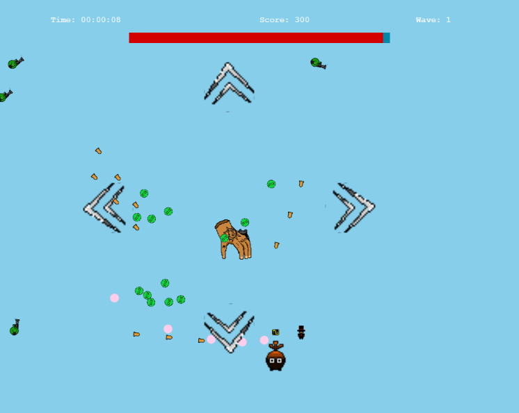

# Card Survival Game

## Table Of Contents

- [About the Project](#about-the-project)
- [Built With](#built-with)
- [Features](#features)
- [Planned Features](#planned-features)
- [Resources Used](#resources-used)
- [Credits](#credits)

## About The Project

Created a FullStack web application to host the Card Survival Game. A Simple shooting game, where the goal is to clear 10 waves of enemies and bosses while collecting powerups. Also featuring a leaderboard for the highest scores and fastest completion times.

## Planning Phase

### Figma

[Link to Figma](https://www.figma.com/design/nZBaQXSxVOg6SsUdOr1e5N/Capstone-wireframe?node-id=19-1163&m=dev&t=pmtUHW6yw36InnQJ-1)

### Entiy Relation Diagram

## Built With

### Frontend

- React.js - JavaScript Library
- Tailwind.css - CSS Library
- Phaser.js - JavaScript Library Game Engine
- Email.js - JavaScript Library For sending emails

### Backend

- Spring Boot - Java Framework
- MySQL - SQL Database

## Features

### Website Features

- User Sign up and Login
- Leaderboard, showing top scores and times
- Support Form thats sends email to CSG team
- Hosts the game!

### Game Features

- Waves of enemies and Bosses
- Collect Power ups
- Post Score to leaderboard if logged in

## Planned Features

### Website

- Add a community forum
- Add a user profile to interact in the forum and view personal scores

### Game

- Add music and sounds to the game
- Increase the number of waves
- Add more enemies and bosses
- Add more powerups

## Resources used

[Piskel](https://www.piskelapp.com/) - Spritesheet and Gif creater

[Phaser Docs](https://newdocs.phaser.io/docs/3.85.2) - Phaser Documentation

## Credits

Questionmark(Me) for most of the Spritesheets 

Bambino for the Slime Turret Spritesheet 
